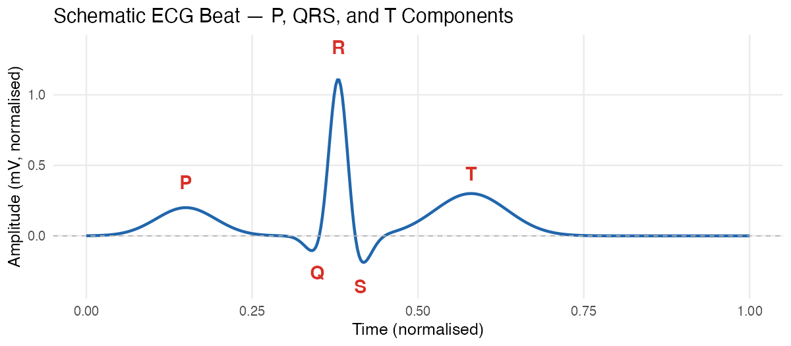
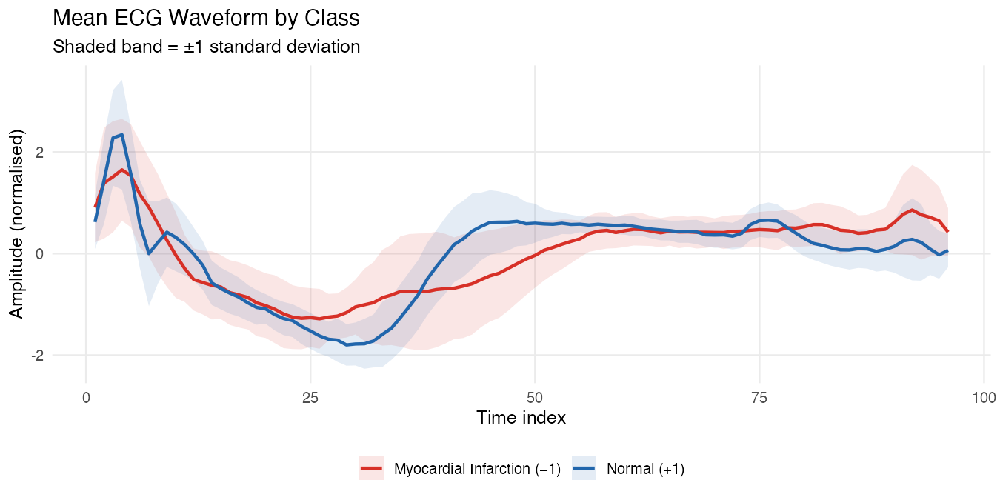
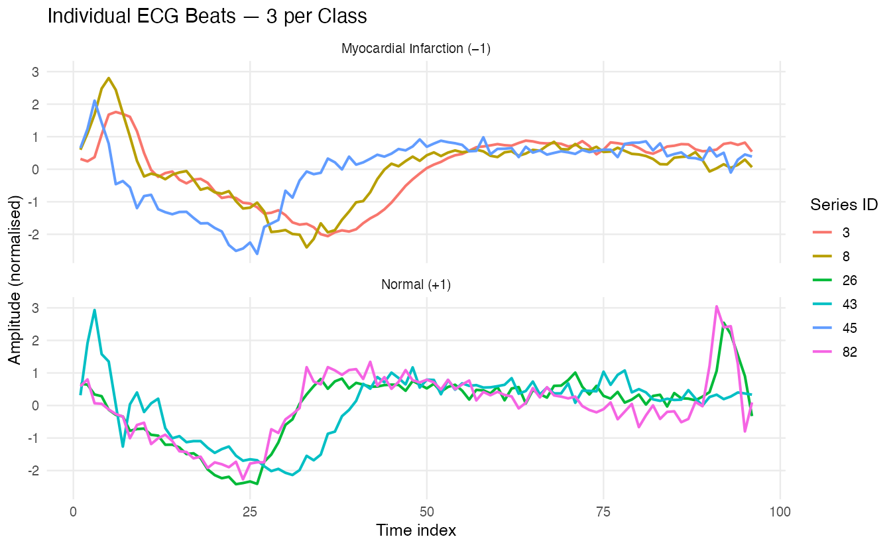

### The ECG200 Dataset {.unnumbered}

#### What Is an ECG Signal?

An **electrocardiogram (ECG)** is a recording of the electrical activity of
the heart over time. Electrodes placed on the skin detect tiny voltages as
the heart muscle depolarises (contracts) and repolarises (relaxes). The
resulting waveform has a characteristic repeating shape composed of three
main features:

- **P wave** --- atrial depolarisation (atria contract)
- **QRS complex** --- ventricular depolarisation (ventricles contract; the
  dominant spike in the waveform)
- **T wave** --- ventricular repolarisation

{fig-align="center" width="80%"}

Abnormalities in the shape, duration, or timing of these components can
indicate myocardial infarction (heart attack), arrhythmia, and other cardiac
conditions. This is why a distance metric that is robust to small timing
shifts matters — we want to compare *shape*, not penalise the algorithm for
minor beat-to-beat timing variation inherent in any real recording.

#### Dataset Description

The **ECG200** dataset was assembled by Olszewski (2001) and is distributed
through the [UCR Time Series Classification Archive](https://www.timeseriesclassification.com/description.php?Dataset=ECG200).
Each observation is a **single heartbeat** extracted from a longer Holter
monitor recording and resampled to **96 equally spaced time points**.

| Attribute | Value |
|---|---|
| Time series length | 96 |
| Training set size | 100 |
| Test set size | 100 |
| Number of classes | 2 |
| Class **+1** (normal) | 69 train / 31 test |
| Class **−1** (myocardial infarction) | 31 train / 69 test |

The binary label identifies whether the beat originated from a **normal**
heartbeat (+1) or from a patient with a **myocardial infarction** (−1). The
UCR Archive notes that MI beats tend to show a depressed or absent R wave,
ST-segment changes, and other morphological deformations. These features
manifest as time-localised shape differences between the two classes, making
ECG200 a natural and well-studied benchmark for DTW-based classification.

#### Visualising the Data

The two classes look clearly different *on average*: normal beats (blue) show
a pronounced, sharp R-wave spike while MI beats (red) exhibit a flatter,
broader profile. Notice also the ±1 SD shaded band — even within the normal
class, the exact *timing* of the R-wave peak varies from beat to beat,
motivating the use of a timing-invariant distance measure like DTW.

{fig-align="center" width="90%"}

Looking at individual beats reinforces the point. Even three normal beats
drawn from the same class show visible left--right timing shifts in the QRS
peak — exactly the kind of variability Euclidean distance would penalise
unfairly, and which DTW is designed to absorb.

{fig-align="center" width="90%"}

---

#### References

UCR Time Series Classification Archive. (n.d.). *ECG200 dataset description.*
<https://www.timeseriesclassification.com/description.php?Dataset=ECG200>
