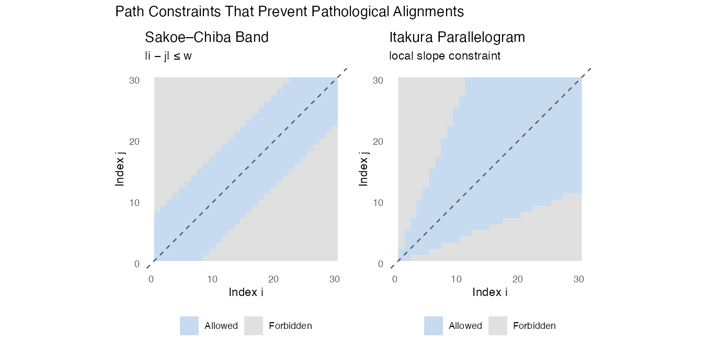
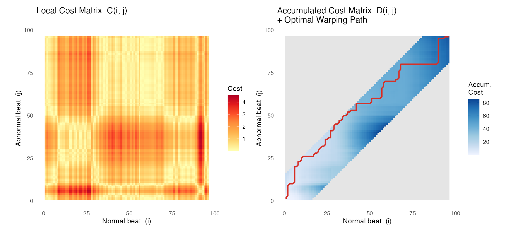
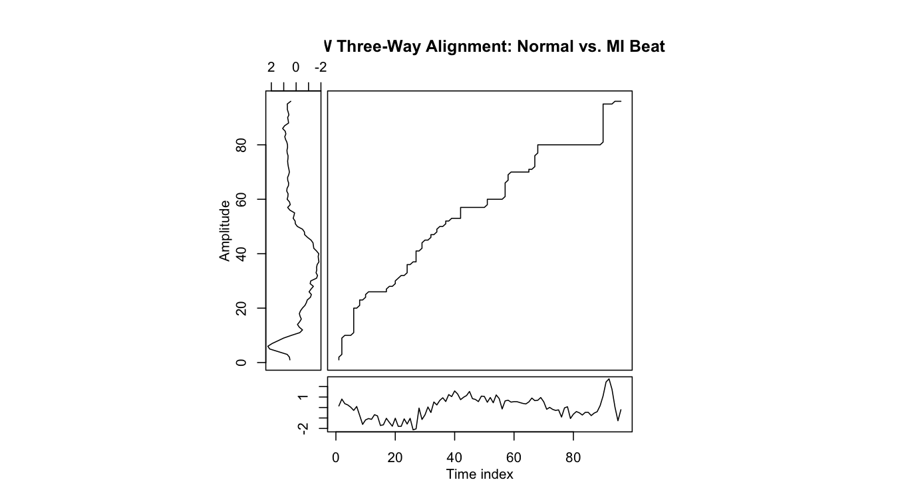

### Motivation: Why Not Just Use Euclidean Distance? {.unnumbered}

When we compare two time series, the most natural instinct is to measure the
**Euclidean distance** — subtract corresponding points, square, sum, and take
a root. This works perfectly when two signals are in lockstep. But real-world
signals are rarely so cooperative.

Consider two ECG heartbeat recordings from the same healthy patient taken
minutes apart. The QRS complex (the sharp spike) may appear a fraction of a
second earlier in one recording than the other, simply because the patient's
heart rate varied slightly. Euclidean distance would report a *large*
mismatch even though the two signals are functionally identical.

**Dynamic Time Warping (DTW)** was introduced precisely to handle this
problem. It finds the *optimal alignment* between two sequences by allowing
one sequence to be non-linearly "warped" in time before measuring the
distance between them.

> **Key intuition:** DTW asks *"how much work does it take to deform one
> signal in time so that it best matches the other?"* The answer to that
> question is the DTW distance.

---

### How DTW Works

#### Setting Up the Cost Matrix

Let $\mathbf{x} = (x_1, x_2, \ldots, x_n)$ and
$\mathbf{y} = (y_1, y_2, \ldots, y_m)$ be two time series of (possibly
different) lengths $n$ and $m$.

**Step 1 — Local cost matrix $C$.**

Construct an $n \times m$ matrix where each entry $C(i, j)$ records the
local dissimilarity between $x_i$ and $y_j$. Squared Euclidean distance is
the most common choice:

$$C(i,j) = (x_i - y_j)^2$$

Think of $C$ as a terrain map. Cells with small values are valleys (the two
signals agree at those positions); cells with large values are mountains
(they disagree). As Tavenard (2021) describes it, this matrix encodes *"how
similar is $x_i$ to $y_j$"* for all possible index pairs simultaneously.

**Step 2 — Accumulated cost matrix $D$.**

We then compute the *accumulated* (or *cumulative*) cost matrix $D$ using
dynamic programming. $D(i, j)$ stores the minimum total cost of any path
that starts at $(1, 1)$ and reaches $(i, j)$:

$$D(1, 1) = C(1, 1)$$

$$D(i, j) = C(i, j) + \min\bigl(D(i-1,\, j),\; D(i,\, j-1),\; D(i-1,\, j-1)\bigr)$$

The three candidates in the $\min$ correspond to the three legal step
directions: advance only in $\mathbf{x}$, advance only in $\mathbf{y}$, or
advance in both simultaneously.

**The DTW distance** is the value at the bottom-right corner of $D$:

$$\text{DTW}(\mathbf{x}, \mathbf{y}) = D(n, m)$$

#### The Warping Path

Once $D$ is filled in, the **warping path** $\mathcal{W}$ is recovered by
tracing back from $(n, m)$ to $(1, 1)$, always stepping toward whichever
neighbor had the smallest accumulated cost. The path is a sequence of index
pairs $(i_k, j_k)$ that describes *which point of $\mathbf{x}$ is matched
to which point of $\mathbf{y}$.*

A valid warping path must satisfy three structural properties:

| Property | What it means |
|---|---|
| **Boundary** | Starts at $(1, 1)$ and ends at $(n, m)$ — both series are fully covered |
| **Continuity** | Each step moves at most one index in either direction — no skipping |
| **Monotonicity** | Indices never decrease — time cannot run backwards |

These three properties together guarantee that the alignment is physically
meaningful: every point gets matched, the matching never "jumps," and the
order of events is preserved.

---

### Constraints That Prevent Pathological Alignments

Without additional restrictions, the DTW optimisation can find alignments that are numerically cheap but practically absurd. The most extreme case is a **degenerate** alignment where the algorithm maps one single point of x\mathbf{x}
x to the *entire* sequence y\mathbf{y}
y — every point in y\mathbf{y}
y gets matched to that one point, the path hugs a wall of the matrix instead of the diagonal, and the cost can be very low while the alignment is completely meaningless. The three structural rules (boundary, continuity, monotonicity) prevent the worst violations, but they do not bound *how far* the path can stray from the diagonal. Two additional constraints address this directly.

#### The Sakoe--Chiba Band

The **Sakoe--Chiba band** (Sakoe & Chiba, 1978) restricts the warping path to
a diagonal corridor of width $w$:

$$|i - j| \leq w$$

Only cells within this band are ever filled in $D$; all others are set to
$\infty$. This prevents a situation where the entire beginning of one series
maps to just the first sample of the other. It also dramatically speeds up
computation — from $O(nm)$ for unconstrained DTW down to $O(n \cdot w)$.

The bandwidth $w$ is a tuning parameter: setting $w = 0$ recovers Euclidean
distance; setting $w = \max(n, m)$ gives unconstrained DTW.

#### The Itakura Parallelogram

The **Itakura parallelogram** (Itakura, 1975) takes a different angle: rather than bounding the absolute position of the path, it constrains the *local slope*. The path cannot advance more than two steps in one direction for every one step in the other, keeping the slope between $\frac{1}{2}$ and 2. This prevents a long run of identical or near-identical values in one series from being collapsed onto a single point of the other — a failure mode the Sakoe–Chiba band alone does not rule out.

Both constraints encode the same domain knowledge: a meaningful alignment between two similar signals should not require dramatic time distortions.

{fig-align="center" width="85%"}

---

### DTW in Action — A Worked Example

To make the cost-matrix and warping-path concepts concrete, we apply DTW to
two actual ECG beats from the training set: one **normal** beat and one **MI**
beat, using a Sakoe--Chiba band of width 15 (approximately 15% of the signal
length).

#### The Cost and Accumulated Cost Matrices

The left panel below shows the **local cost matrix** $C$: bright (yellow)
cells are pairs of time points where the two signals agree most; dark (red)
cells are where they differ most. The right panel shows the **accumulated
cost matrix** $D$ with the **optimal warping path** overlaid in red.

The path hugs the main diagonal, confirming the two beats are broadly similar
in timing. Where it bends away from the diagonal — primarily around the QRS
region — DTW is absorbing the morphological difference between the sharp
normal R-wave spike and the flattened MI profile.

{fig-align="center" width="95%"}

#### Signal Alignment Visualisation

The three-way alignment plot shows the two raw signals alongside the
point-to-point correspondences defined by the warping path. Each connecting
line links a time point in the normal beat (top) to its matched point in the
MI beat (bottom). The right panel confirms the path deviates from the
diagonal near the QRS region — where the largest shape difference between the
two beat types occurs.

{fig-align="center" width="95%"}

---

### Section Summary

| Concept | Key Takeaway |
|---|---|
| **Local cost matrix** $C$ | Pairwise dissimilarity between every time-point pair — the "terrain" DTW traverses |
| **Accumulated cost matrix** $D$ | Minimum-cost path to $(i,j)$, built by dynamic programming |
| **Warping path** $\mathcal{W}$ | Optimal alignment recovered by back-tracing $D$ |
| **Boundary / Continuity / Monotonicity** | Structural rules ensuring the path is complete, connected, and time-forward |
| **Sakoe--Chiba band** | Limits degree of time warping; prevents degenerate alignments; speeds computation |
| **ECG200 dataset** | 100-train / 100-test ECG beats, 96 time points, binary label (normal vs. MI) |

---

#### References

Giorgino, T. (2009). Computing and visualizing dynamic time warping
alignments in R: The `dtw` package. *Journal of Statistical Software*,
*31*(7), 1--24. <https://doi.org/10.18637/jss.v031.i07>

Itakura, F. (1975). Minimum prediction residual principle applied to speech
recognition. *IEEE Transactions on Acoustics, Speech, and Signal Processing*,
*23*(1), 67--72.

Olszewski, R. T. (2001). *Generalized feature extraction for structural
pattern recognition in time-series data* [Doctoral dissertation, Carnegie
Mellon University].

Sakoe, H., & Chiba, S. (1978). Dynamic programming algorithm optimization
for spoken word recognition. *IEEE Transactions on Acoustics, Speech, and
Signal Processing*, *26*(1), 43--49.

Tavenard, R. (2021). *An introduction to dynamic time warping.*
<https://rtavenar.github.io/blog/dtw.html>

UCR Time Series Classification Archive. (n.d.). *ECG200 dataset description.*
<https://www.timeseriesclassification.com/description.php?Dataset=ECG200>
