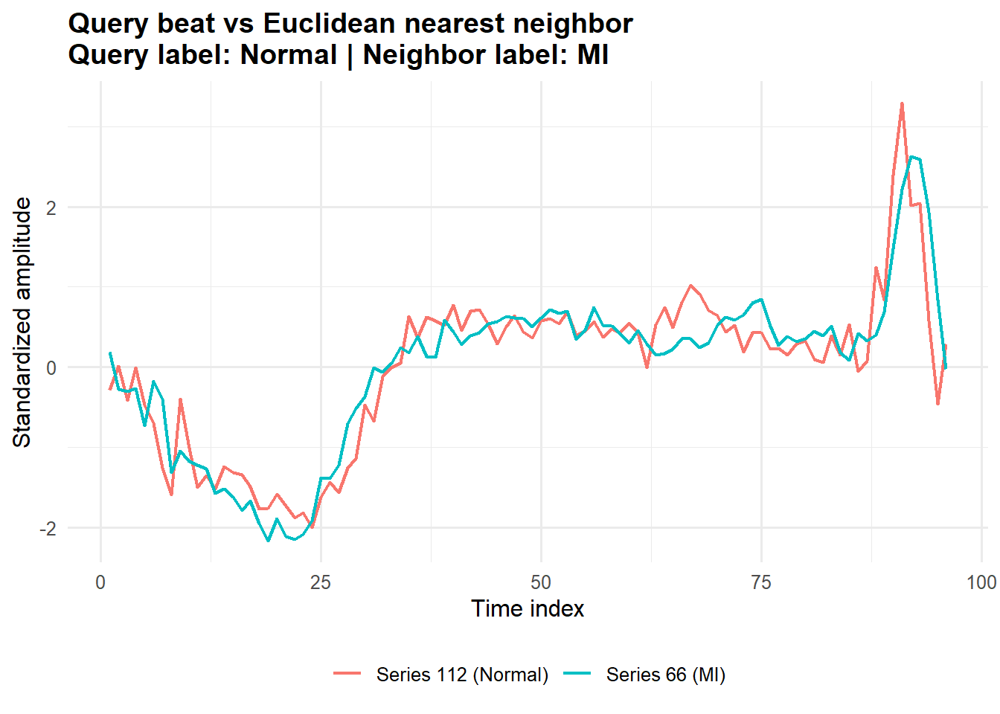
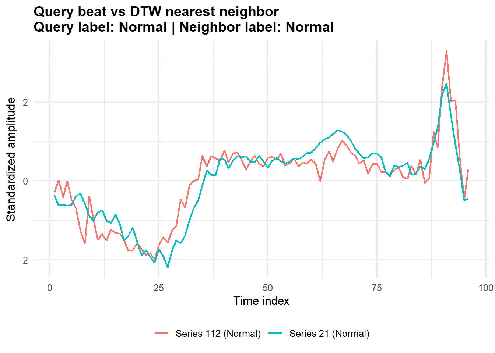
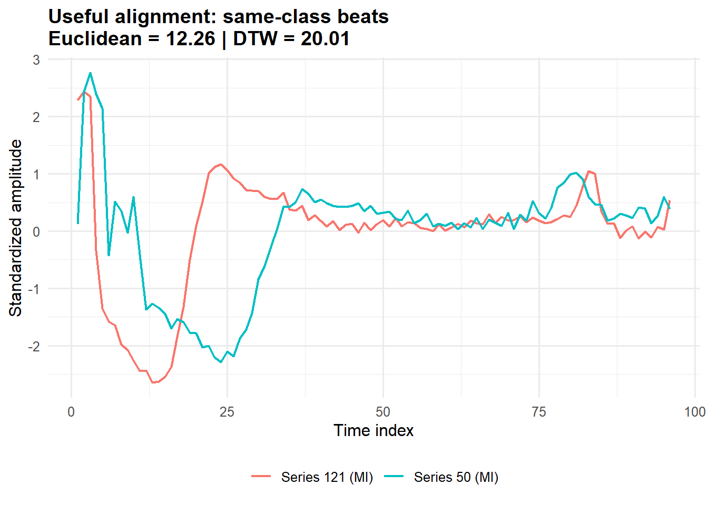
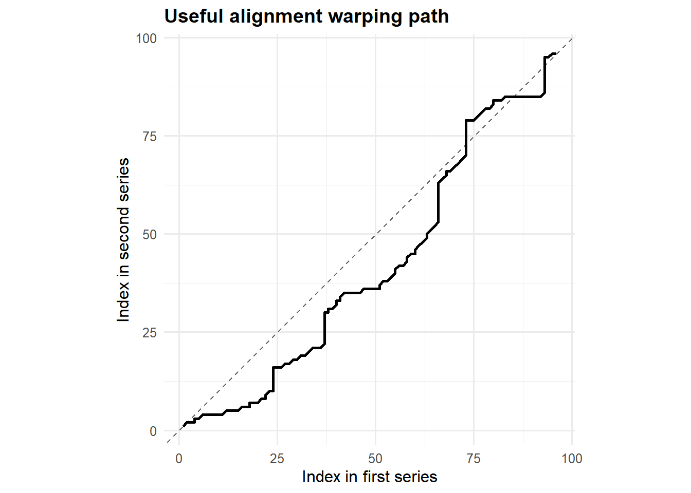
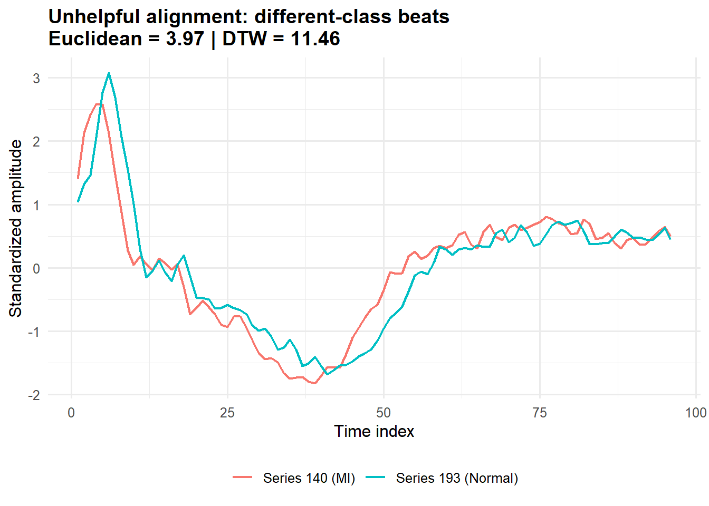
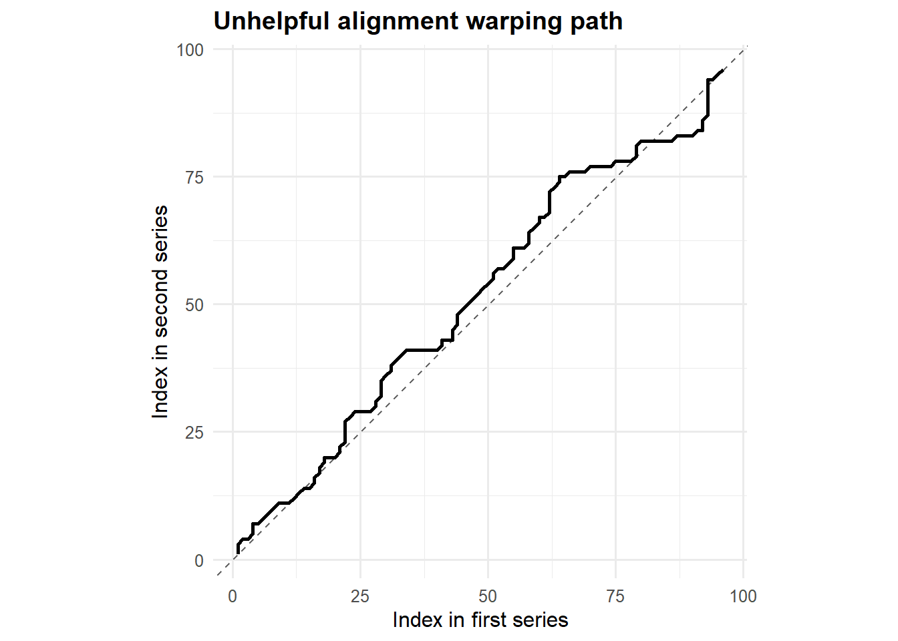

## Empirical Demonstration {.unnumbered}

This section shows what DTW adds beyond a standard point-by-point distance. Euclidean distance compares beats at the same time index. DTW allows small local timing shifts, so it can match beats by overall shape rather than exact alignment in time.

<b>Comparing DTW with Euclidean distance</b>

These two figures use the same query beat but change the similarity metric.

With Euclidean distance, the nearest neighbor comes from the wrong class. The pointwise comparison looks close, but it misses the more meaningful shape match.

{width=90% fig-align="center"}

With DTW, the nearest neighbor comes from the correct class. Allowing local time warping recovers a beat with more similar overall morphology.

{width=90% fig-align="center"}

Main takeaway: DTW changes the retrieval result in a way that better reflects the underlying shape of the signal.

<b>Useful alignment</b>

This is a case where DTW is doing something useful. The two beats are both labeled MI. Their main features are similar, but they occur at slightly different time locations.

{width=90% fig-align="center"}

The warping path moves away from the diagonal in a controlled way. That means DTW is making small timing adjustments so the major waveform components line up better.

{width=75% fig-align="center"}

Main takeaway: this is the setting DTW is built for, similar shape with mild timing variation.

<b>Unhelpful alignment</b>

DTW can also align the wrong thing. These two beats come from different classes, but DTW still finds a reasonably close match because part of the broad shape looks similar.

{width=90% fig-align="center"}

The warping path does not look extreme, which makes this a subtle failure. The alignment is numerically reasonable, but not clinically meaningful.

{width=75% fig-align="center"}

Main takeaway: DTW measures shape similarity under flexible timing, not scientific relevance. In settings like fetal monitoring, a method could align a repeating maternal heartbeat pattern well even if that is not the signal of interest.

<b>Bottom line</b>

DTW helps when timing differences are nuisance variation and shape is what matters. But a low DTW distance is not enough on its own. The match still has to make sense in the domain.
