## Evaluation and Critique

DTW measures similarity between time series that may be misaligned in time. Instead of comparing points strictly at the same time index, it allows the time axis to stretch or compress locally to find the best alignment between two sequences.

- Assumes that two signals may represent the same underlying pattern, occurring at different speeds.
- Assumes that local timing differences are not meaningful differences in the signal itself.
- Similarity defined as the minimum cumulative distance along an optimal alignment path through a cost matrix

Very useful in our example of diagnosing STEMI, where global shape is the most important attribute, and timing or beat length (heart rate) are less crucial to making the diagnosis. 

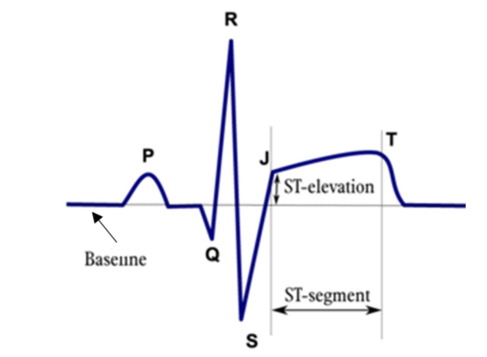{width=70% fig-align="center"}

Another good use is for respiratory variation in heart rate: 

This is a normal heart rate, with variation due to respiration. DTW would be able to recognize the similar underlying pattern occuring at slightly different speeds: 

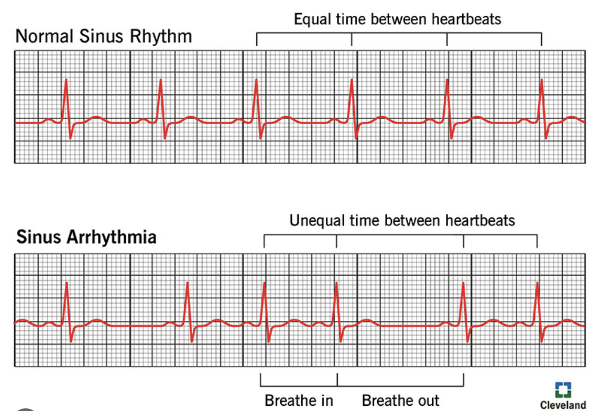{width=70% fig-align="center"}

<b>DTW can be problematic or misleading in several scenarios</b>

**Scenario 1: When timing is important**

Example: Heart rate is meaningful, and slow rates can be dangerous (bradycardia). DTW alignment may ignore important information on rates:

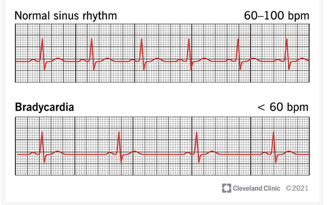{width=70% fig-align="center"}

**Scenario 2: When excessive warping creates inappropriate matches:**

Example: Extreme stretching may lead to inappropriate alighnment, in this is example a large pause in heart beat may be ignored. 

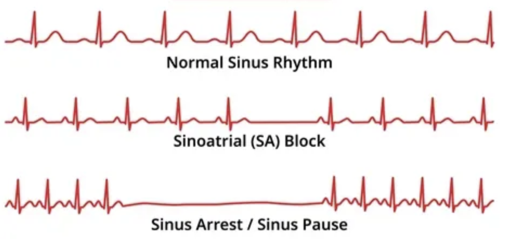{width=70% fig-align="center"}

**Scenario 3: When Amplitude or Magnitude is important**

DTW primarily aligns on shape, and may not capture important magnitude differences. Additionally, normalization used in many DTW workflows may ignore magnitude differences. 

Example: Difference in wave amplitudes can indicate a life-threatening pericardial effusion (fluid around the heart), which may be minimized with DTW. 

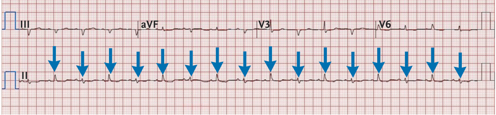{width=100% fig-align="center"}

**Scenario 4: When there is noisy signal, which could lead to over-fitting of noise**

DTW may over emphasize pattern fitting, and over-fit to noise. 

Example: When a patient is moving, signal can become noisy and be misinterpreted for cardiac activity. 

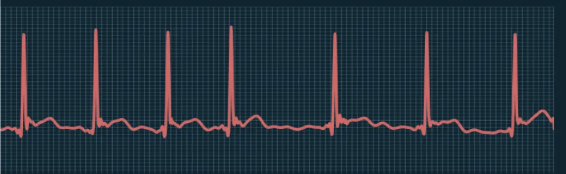{width=70% fig-align="center"}
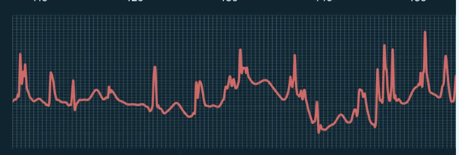{width=70% fig-align="center"}

**Scenario 5: Flexibility may lead to over-alignment of unrelated signals coming from entirely different processes**

DTW is flexible and can align signals that may be generated by a different process. 

Example: EKG and EEG (brain wave) could be mistakenly aligned. 

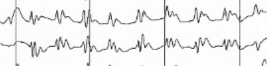{width=70% fig-align="center"}

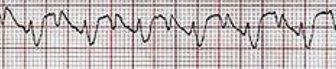{width=70% fig-align="center"}

<b>Useful Constraints can help address these scenarios</b>

**1. Warping path constraints**

- These restrict how far the warping path can deviate from the diagonal of the cost matrix.

Example: Sakoe–Chiba band

Effects:
- Limits how far in time two points can be matched (width = w)
- Prevents extreme stretching (e.g., one point matched to 50 points)

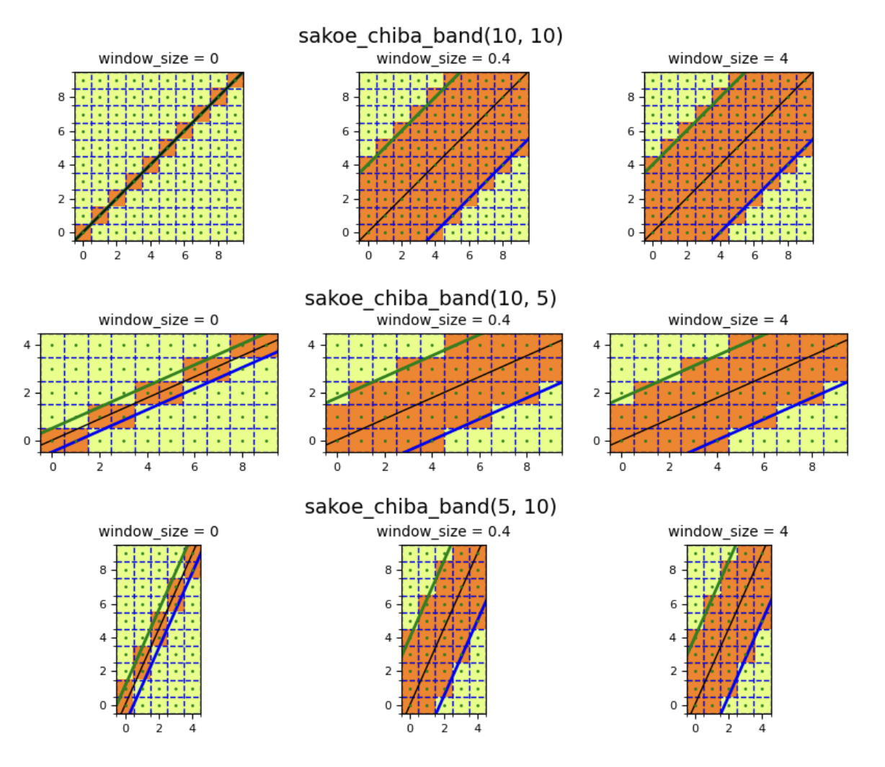{width=70% fig-align="center"}

**2. Step pattern constraints**

- Local slope constraints which restrict the how path can move locally

Effects:
- Prevents extreme compression/stretching
- Avoids matching one point to many points

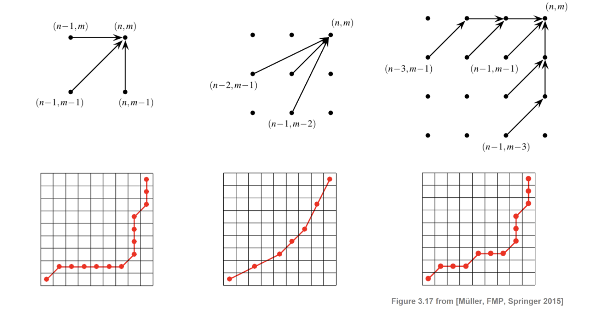{width=70% fig-align="center"}

