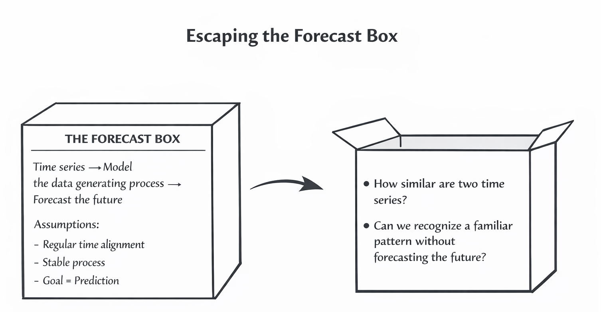
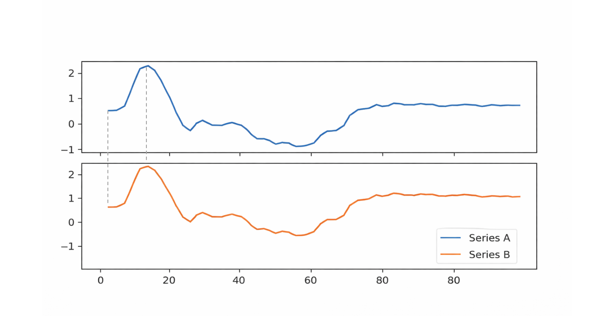
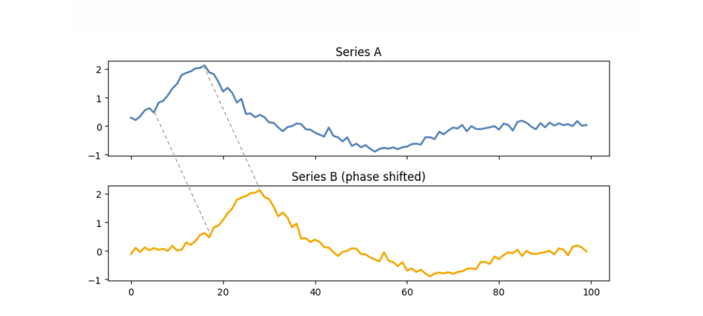
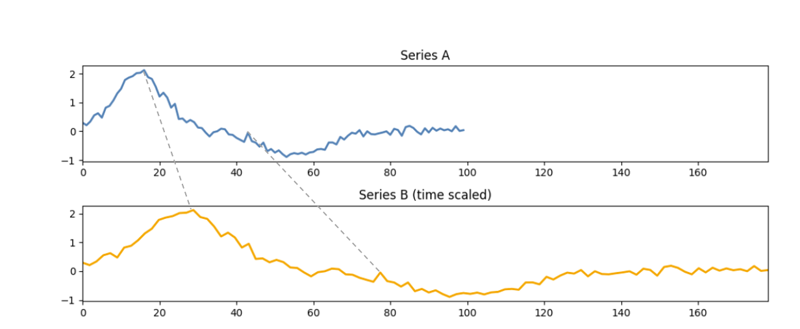
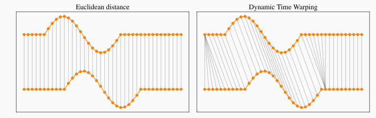
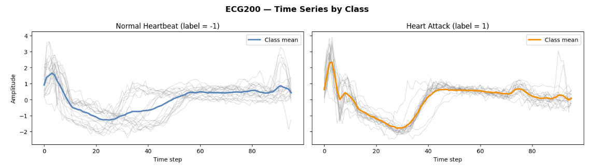

### New Paradigms {.unnumbered}
{fig-align="center" width="100%"}

### Ideal Universe 
{fig-align="center" width="100%"}

### Time series in the real world
{fig-align="center" width="100%"}
{fig-align="center" width="90%"}

### Dynamic Time Warping
{fig-align="center" width="100%"}

::: {.callout-note title="Point-by-Point Matching example"}
```
Euclidean distance

M  E  O  W
|  |  |  |
M  E  O  W


Dynamic Time Warping

M  E  O              W
|  |  |\⟍            |
|  |  | \ ⟍          |
|  |  |  \  ⟍        |
|  |  |   \   ⟍      |
M  E  O    O    O    W
```
:::


### Empirical demonstration and Performance metrics
```{r}
#| message: false
#| echo: false
#| warning: false

library(readr)
library(gt)

summary_clean <- read_csv("ECG200/results/summary_clean.csv")
summary_jitter <- read_csv("ECG200/results/summary_jitter.csv")
summary_f1_drop <- read_csv("ECG200/results/summary_f1_drop.csv")
```

```{r}
#| message: false
#| echo: false
#| warning: false

summary_clean |>
  gt() |>
  tab_header(title = "Model Evaluation : Aligned Data") |>
  fmt_number(columns = where(is.numeric), decimals = 3) |>
  data_color(columns = Accuracy, palette = "Blues")
```

```{r}
#| message: false
#| echo: false
#| warning: false

summary_jitter |>
  gt() |>
  tab_header(title = "Model Evaluation : Phase shifted data") |>
  fmt_number(columns = where(is.numeric), decimals = 3) |>
  data_color(columns = Accuracy, palette = "Oranges")
```

```{r}
summary_f1_drop |>
  gt() |>
  tab_header(title = "F1 Degradation from phase shift") |>
  fmt_number(columns = where(is.numeric), decimals = 3) |>
  data_color(columns = F1_drop, palette = "Reds")
```

### Why this matters
{fig-align="center" width="100%"}
